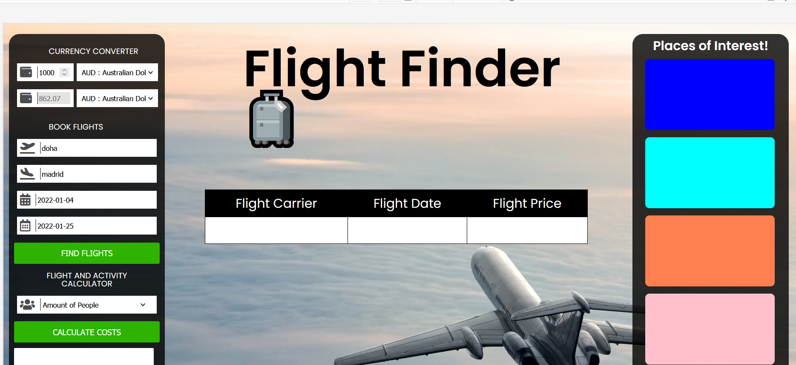

# Flight Finder

## Project Description

The Project requirement was to work in a team and come up with a webpage which uses two server-side API. The project required the team to work collaboratively and demonstrate the skills learnt in unit 1 to 6 of the course curriculum.

The skills we are able to demonstrate include HTML, CSS, JS script and functions along with integration with API.

We used best practice at all times to ensure there is no conflict and we worked in a controlled project. 

Once the team decided on the project idea, we created a wireframe and created a HTML skeleton for the basis of the ongoing work.

**Project idea & MVP**

* Build an application which searches for flights using Sky Scanner API and Travel Places.
* A user can input a from destination.
* A user can input a to destination.
* A user can input a to and from date and is presented with the airline options.
* The user can choose the best available based on airline, time and price.
* When a user searches a destination, popular activities will be listed within the searched city.
* The user has the ability to update the local currency so prices are converted into the chosen currency.
* The user has the ability to generate a per person cost based off the total flight and (activity).

**Wireframe**

**APIs used for project**

https://skyscanner.github.io/slate/#authentication - To obtain the flight based on the search criteria

https://travel-places.p.rapidapi.com/ - To obtain the places of interest based on the search criteria

https://api.frankfurter.app/currencies  - To obtain a list of currency conversion based on search criteria

https://api.openweathermap.org - To obtain the latitude and longitude for the cities in order to search for places of interest

**Tools used for collaborating the project**

* Github - to create branches to push code for code review and deployment
* Kanban wall - to distinguish the required task to complete the project. Kanban consist of 4 columns e.g to do, in progress, review & done/deployed

**Project challenges and what we could do better**

**Challenge 1 - inexperience** - The challenges we faced as a group was none of us had experience coding in a team environment. We have only worked on our own homework so deciding who should work on which part was our initial challenge. This was very quickly resolved by creating task and assigning it on the Kanban.

**Challenge 2 - API challenges** - Because our API is tightly managed by flight companies, we did not have a lot of data to work with. The Sky Scanner API didn't allow all major airlines and flight times. In future we could look at the API documentation or if we had more time sign up an API with richer information.

This also included the Travel Places API, our idea was to be able to display the photos of the points of interest (POI), a summary of the POI, a star rating and the amount it would cost to attend, due to lack of details we were only able to display the name and type. We used placeholder images of Sydney in lieu of the actual images to display in it's place. 

**Challenge 3 - Time constraints** - As we each work full time it was hard to get a time to work together. We were challenged as there was uncertainty on what was completed and what was outstanding at any given time. 
We used Zoom to communicate and when we had class time we were able to assist each other.

**other challenge**

**other challenge**

**The evolution of Flight Finder**

 

**Deployed Webpage Link:** https://trangthedev.github.io/flightFinder/

**Final presentation URL:** https://docs.google.com/presentation/d/1NZ2yRj-iDHwmwE-f3eKFsq03-Q-l-IuRCK6_0a_k6hw/edit#slide=id.p

*Note*: for presentation we will use Sydney as a placeholder for places of interest when nothing else has loaded.

